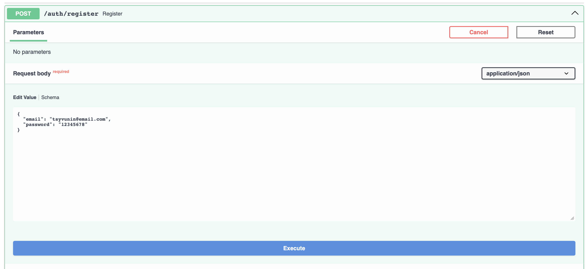
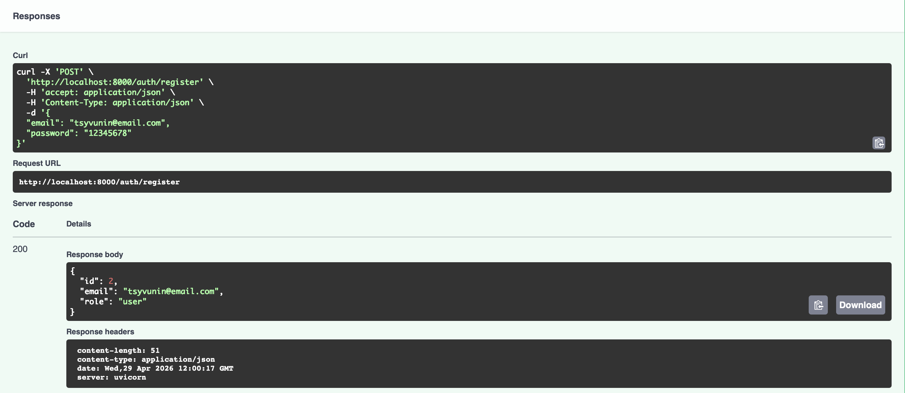
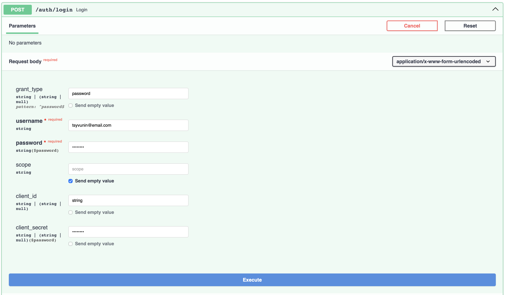
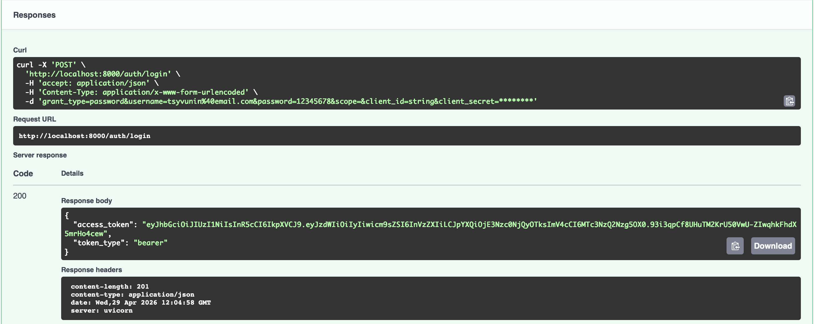
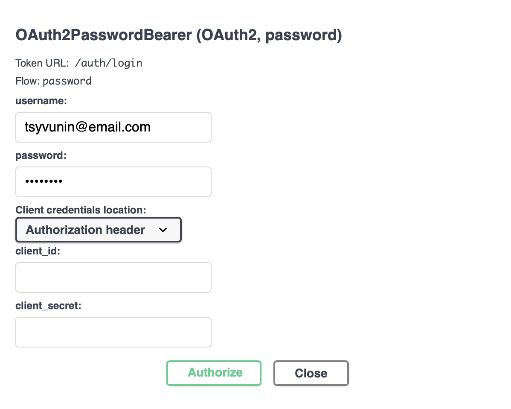
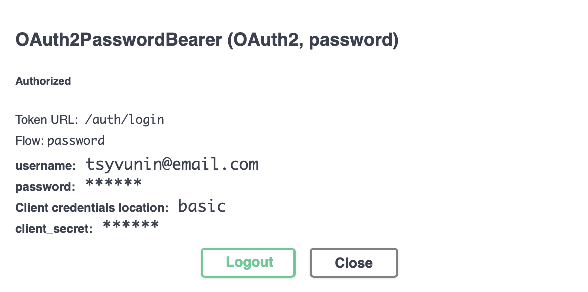
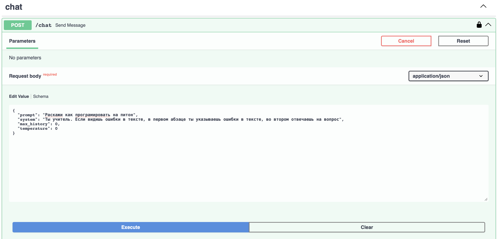
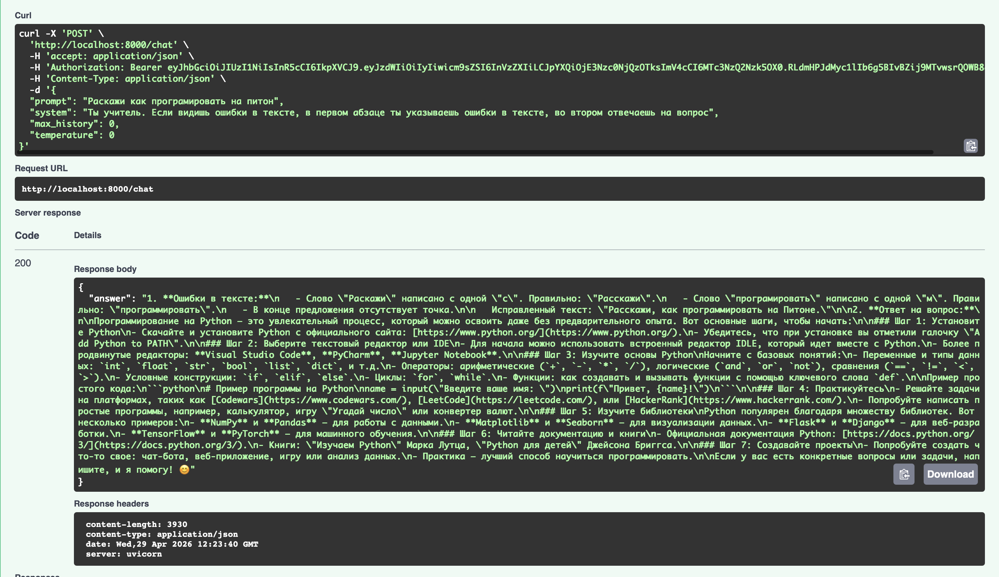
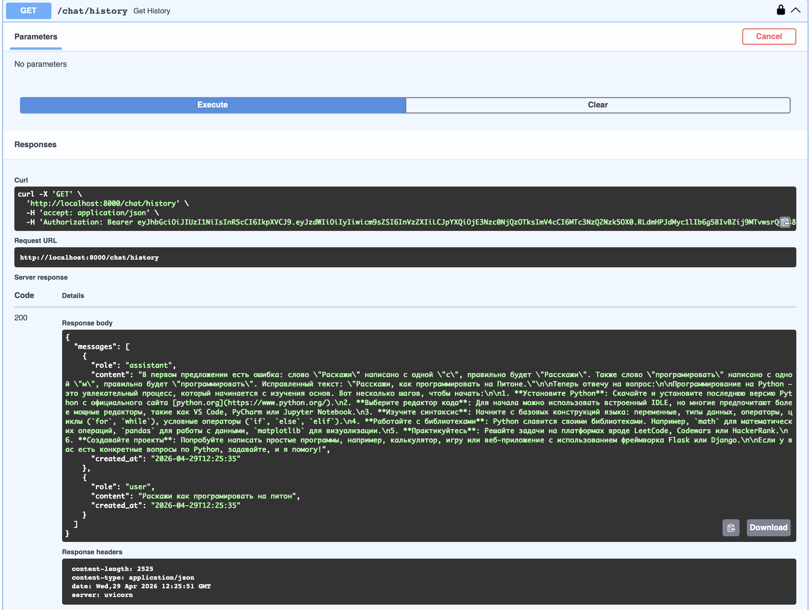
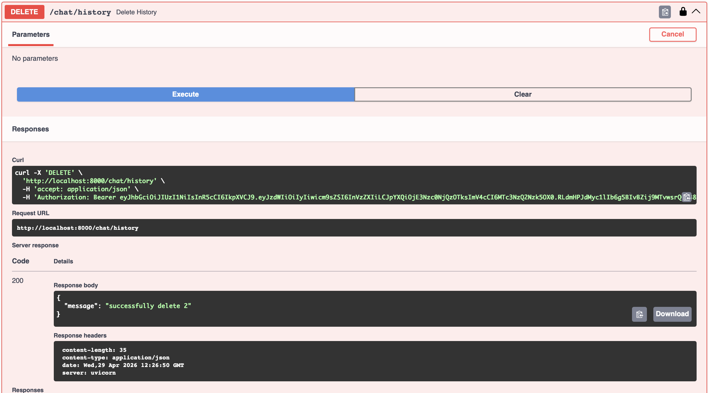

# Настройка проекта
**Если uv не установлен:**
```
pip install uv
```

**Установка зависимостей проекта:**
```
uv sync
```
или
```
make depends
```

*Активация виртуального окружения (опционально):*
```
source .venv/bin/active
```

**Конфигурация**
Создайте файл *.env* в корне проекта

Переменные:
- OPENROUTER_API_KEY - API ключ к openrouter
- APP_NAME - название приложения
- ENV - окружение

- JWT_SECRET - секретный ключ JWT
- JWT_ALG - алгоритм шифрование JWT
- ACCESS_TOKEN_EXPIRE_MINUTES - время жизни токена в минутах

- SQLITE_PATH - путь к папке SQLite

- OPENROUTER_BASE_URL - путь к OpenRouter
- OPENROUTER_MODEL - LLM модель
- OPENROUTER_SITE_URL - host приложения (отправлятся в openrouter)
- OPENROUTER_APP_NAME - название проекта (отправляется в openrouter)

**Запуск проекта:**
```
uv run uvicorn app.main:app --reload --host <host> --port <port>
```
или
```
make run
```

# Пример использования
## Регистрация



## Логин



## Авторизация через Swagger



## Вызов chat



## Получение истории сообщений


## Удаление истории сообщений
